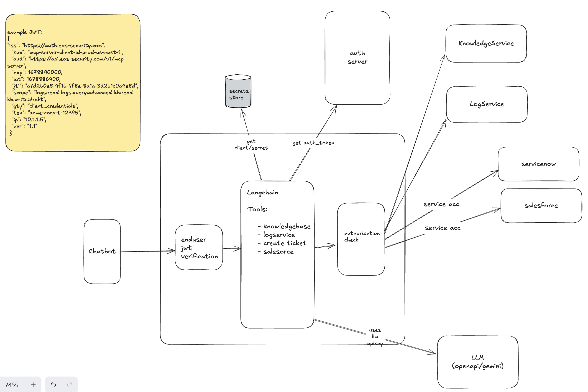

# **Eos Security Assistant Prototype**

This project is a full-stack prototype of an AI-powered assistant for enterprise security, demonstrating a conversational interface combined with agentic AI for autonomous tool usage.

It is built as a single, self-contained Node.js server (mcp-server.js) that includes the main chatbot application, an agentic AI powered by LangChain, and several mock backend services.

## **Core Features**

* **Conversational AI:** A simple web-based chatbot UI for natural language queries.  
* **Agentic AI:** Uses LangChain and a Gemini LLM to understand user intent and autonomously call external tools.  
* **Security-Aware:** Implements two layers of security:  
  1. **User RBAC:** The agent checks a user's role (hardcoded) before granting access to sensitive tools.  
  2. **M2M Authorization:** The server fetches a JWT with fine-grained scopes from a mock auth server and validates these scopes before executing a tool.  
* **Audit Logging:** Logs all significant events (queries, responses, tool calls, auth failures) to the console for traceability.

## **Setup & Running**

### **Prerequisites**

* [Node.js](https://nodejs.org/) (v18 or later)  
* npm (or yarn)  
* A Gemini API Key

### **Installation**

1. Clone this repository.  
2. Install the required npm packages:  
   npm install

3. Create a .env file in the root of the project and add your API key and a secret:  
   GEMINI\_API\_KEY=your\_gemini\_api\_key\_here  

4. Run the server:  
   npm start

   *Or, for development with auto-reloading:*  
   npm run dev

The main chatbot server will be running on http://localhost:4000.  

## **Architecture & Mock Services**

The core of this application is the McpServer class. It uses **LangChain** to create an agent that connects a Large Language Model (Gemini) to a set of custom tools.

When a user sends a query:

1. The query goes to the LangChain agent.  
2. The LLM analyzes the query and the agent's systemMessage instructions.  
3. It decides if it needs to use a tool (e.g., query\_logs or search\_knowledge\_base).  
4. If it chooses a tool, it extracts the correct keyword (e.g., "bad password") and calls the tool function.  
5. The tool function (e.g., logQueryTool) performs security checks (RBAC, M2M scopes) before running.  
6. The tool fetches data from a mock service and returns it to the agent.  
7. The LLM receives the data and formulates a natural language response for the user.

### **Mock Services**

The following services are simulated as JavaScript classes within mcp-server.js for this prototype:

* **KnowledgeService**: Simulates a production service for security policies and playbooks. In a real-world application, this would be a separate microservice connected to a **Vector Database** (like Pinecone or Weaviate) to perform efficient Retrieval-Augmented Generation (RAG).  
* **LogService**: Simulates a SIEM or log database API. It holds mock logs in memory. In. production, this would be a secure API endpoint for a service like Splunk, Datadog, or Elasticsearch.  
* **MockAuthServer**: A complete, separate Express server running on port 5000\. It simulates an M2M OAuth 2.0 provider, issuing signed JWTs with fine-grained scope claims (e.g., logs:read kb:read).

## **System Design**

The following diagram illustrates the high-level architecture:

